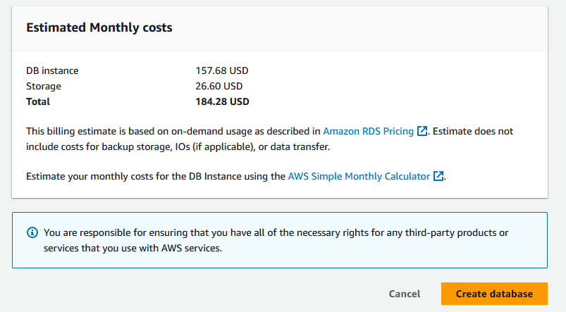

# Create a database using the Relational Database Service (RDS)

In this task you will create a new RDS database that will replace the MySQL
database currently used by Drupal.


Please read the document
[What Is Amazon Relational Database Service (Amazon RDS)?](https://docs.aws.amazon.com/AmazonRDS/latest/UserGuide/Welcome.html)
for reference. Once you have read the document, please perform the following
steps:

## Task 01 - Prerequisites for RDS Deployment

### [Delete current private subnet](https://awscli.amazonaws.com/v2/documentation/api/latest/reference/ec2/delete-subnet.html)

\[INPUT\]

```bash
aws ec2 describe-subnets --filters "Name=tag:Name,Values=SUB-PRIVATE-DEVOPSTEAM18" --query "Subnets[*].SubnetId"
// subnet-0d395759a91c4d4b8

aws ec2 delete-subnet --subnet-id subnet-0d395759a91c4d4b8
```

\[INPUT\]

```bash
// Describe subnet (to check if always available)
aws ec2 describe-subnets --subnet-id subnet-0d395759a91c4d4b8
```

\[OUTPUT\]

```txt
An error occurred (InvalidSubnetID.NotFound) when calling the DescribeSubnets operation: The subnet ID 'subnet-0d395759a91c4d4b8' does not exist
```

### [Create your subnets](https://awscli.amazonaws.com/v2/documentation/api/latest/reference/ec2/create-subnet.html)

| Key            | Value                         |
| :------------- | :---------------------------- |
| Name           | SUB-PRIVATE-DEVOPSTEAM[XX]a/b |
| VPC            | Refer to infra schema         |
| CIDR-BLOCK     | Refer to infra schema         |
| Inbound rules  | Refer to infra schema         |
| Outbound rules | Refer to infra schema         |

\[INPUT\]

```bash
// Create subnet A
aws ec2 create-subnet \
    --vpc-id vpc-03d46c285a2af77ba \
    --cidr-block 10.0.18.0/28 \
    --tag-specifications 'ResourceType=subnet,Tags=[{Key=Name,Value=SUB-PRIVATE-DEVOPSTEAM18a}]'
```

\[OUTPUT\]

```json
{
    "Subnet": {
        "AvailabilityZone": "eu-west-3a",
        "AvailabilityZoneId": "euw3-az1",
        "AvailableIpAddressCount": 11,
        "CidrBlock": "10.0.18.0/28",
        "DefaultForAz": false,
        "MapPublicIpOnLaunch": false,
        "State": "available",
        "SubnetId": "subnet-0bd3b8cdf25b8042e",
        "VpcId": "vpc-03d46c285a2af77ba",
        "OwnerId": "709024702237",
        "AssignIpv6AddressOnCreation": false,
        "Ipv6CidrBlockAssociationSet": [],
        "Tags": [
            {
                "Key": "Name",
                "Value": "SUB-PRIVATE-DEVOPSTEAM18a"
            }
        ],
        "SubnetArn": "arn:aws:ec2:eu-west-3:709024702237:subnet/subnet-0bd3b8cdf25b8042e",
        "EnableDns64": false,
        "Ipv6Native": false,
        "PrivateDnsNameOptionsOnLaunch": {
            "HostnameType": "ip-name",
            "EnableResourceNameDnsARecord": false,
            "EnableResourceNameDnsAAAARecord": false
        }
    }
}
```

\[INPUT\]

```bash
// Create subnet B
aws ec2 create-subnet \
    --vpc-id vpc-03d46c285a2af77ba \
    --cidr-block 10.0.18.128/28 \
    --tag-specifications 'ResourceType=subnet,Tags=[{Key=Name,Value=SUB-PRIVATE-DEVOPSTEAM18b}]' \
    --availability-zone-id euw3-az2
```

\[OUTPUT\]

```json
{
    "Subnet": {
        "AvailabilityZone": "eu-west-3b",
        "AvailabilityZoneId": "euw3-az2",
        "AvailableIpAddressCount": 11,
        "CidrBlock": "10.0.18.128/28",
        "DefaultForAz": false,
        "MapPublicIpOnLaunch": false,
        "State": "available",
        "SubnetId": "subnet-04a2fc4d8de790824",
        "VpcId": "vpc-03d46c285a2af77ba",
        "OwnerId": "709024702237",
        "AssignIpv6AddressOnCreation": false,
        "Ipv6CidrBlockAssociationSet": [],
        "Tags": [
            {
                "Key": "Name",
                "Value": "SUB-PRIVATE-DEVOPSTEAM18b"
            }
        ],
        "SubnetArn": "arn:aws:ec2:eu-west-3:709024702237:subnet/subnet-04a2fc4d8de790824",
        "EnableDns64": false,
        "Ipv6Native": false,
        "PrivateDnsNameOptionsOnLaunch": {
            "HostnameType": "ip-name",
            "EnableResourceNameDnsARecord": false,
            "EnableResourceNameDnsAAAARecord": false
        }
    }
}
```

### [Create your security groups](https://awscli.amazonaws.com/v2/documentation/api/latest/reference/ec2/create-security-group.html)

| Key            | Value                                |
| :------------- | :----------------------------------- |
| Name           | SG-PRIVATE-DRUPAL-DEVOPSTEAM[XX]-RDS |
| Inbound rules  | Refer to infra schema                |
| Outbound rules | Refer to infra schema                |

\[INPUT\]

```bash
aws ec2 create-security-group \
    --group-name SG-PRIVATE-DRUPAL-DEVOPSTEAM18-RDS \
    --description "Allow ports 22 and 8080" \
    --vpc-id vpc-03d46c285a2af77ba \
    --tag-specifications 'ResourceType=security-group,Tags=[{Key=Name,Value=SG-PRIVATE-DRUPAL-DEVOPSTEAM18-RDS}]'
```

\[OUTPUT\]

```json
{
    "GroupId": "sg-059f0b49f5ca4aab8",
    "Tags": [
        {
            "Key": "Name",
            "Value": "SG-PRIVATE-DRUPAL-DEVOPSTEAM18-RDS"
        }
    ]
}
```

\[INPUT\]

```bash
aws ec2 authorize-security-group-ingress \
    --group-id sg-059f0b49f5ca4aab8 \
    --ip-permissions IpProtocol=tcp,FromPort=3306,ToPort=3389,IpRanges='[{CidrIp=10.0.18.0/28, Description="Subnet A"}, {CidrIp=10.0.18.128/28, Description="Subnet B"}]' \
    --tag-specifications 'ResourceType=security-group-rule,Tags=[{Key=Name,Value=MYSQL-ALLOW}, {Key=Description, Value=Allow MySQL}]'
```

\[OUTPUT\]

```json
 {
    "Return": true,
    "SecurityGroupRules": [
        {
            "SecurityGroupRuleId": "sgr-0afcce0f9e0c71502",
            "GroupId": "sg-059f0b49f5ca4aab8",
            "GroupOwnerId": "709024702237",
            "IsEgress": false,
            "IpProtocol": "tcp",
            "FromPort": 3306,
            "ToPort": 3389,
            "CidrIpv4": "10.0.18.0/28",
            "Description": "Subnet A",
            "Tags": [
                {
                    "Key": "Description",
                    "Value": "Allow MySQL"
                },
                {
                    "Key": "Name",
                    "Value": "MYSQL-ALLOW"
                }
            ]
        },
        {
            "SecurityGroupRuleId": "sgr-0c04594dcb64e347a",
            "GroupId": "sg-059f0b49f5ca4aab8",
            "GroupOwnerId": "709024702237",
            "IsEgress": false,
            "IpProtocol": "tcp",
            "FromPort": 3306,
            "ToPort": 3389,
            "CidrIpv4": "10.0.18.128/28",
            "Description": "Subnet B",
            "Tags": [
                {
                    "Key": "Description",
                    "Value": "Allow MySQL"
                },
                {
                    "Key": "Name",
                    "Value": "MYSQL-ALLOW"
                }
            ]
        }
    ]
}

```

### [Deploy your instance based on your own AMI inside the subnet A](https://docs.aws.amazon.com/cli/latest/userguide/cli-services-ec2-instances.html)

| Key           | Value                               |
| :------------ | :---------------------------------- |
| Name          | EC2_PRIVATE_DRUPAL_DEVOPSTEAM[XX]_A |
| AMI           | yours                               |
| Subnet        | your private subnet                 |
| Key           | your key                            |
| Instance type | t3.micro                            |
| OS Storage    | 1x10 Go gp3                         |

```bash
[INPUT]
// Launch instance A based on your AMI
aws ec2 run-instances \
                   --image-id ami-058adb4d984c76f24 \
                   --count 1 \
                   --instance-type t3.micro \
                   --key-name CLD_KEY_DRUPAL_DEVOPSTEAM18 \
                   --private-ip-address 10.0.18.10 \
                   --security-group-ids sg-060333a9f2656e446 sg-059f0b49f5ca4aab8 \
                   --subnet-id subnet-0bd3b8cdf25b8042e \
                   --tag-specifications 'ResourceType=instance,Tags=[{Key=Name,Value=EC2_PRIVATE_DRUPAL_DEVOPSTEAM18_A}]'
```

\[OUTPUT\]

```json
{
    "Groups": [],
    "Instances": [
        {
            "AmiLaunchIndex": 0,
            "ImageId": "ami-058adb4d984c76f24",
            "InstanceId": "i-08b03e25dbfb38598",
            "InstanceType": "t3.micro",
            "KeyName": "CLD_KEY_DRUPAL_DEVOPSTEAM18",
            "LaunchTime": "2024-03-14T15:28:12+00:00",
            "Monitoring": {
                "State": "disabled"
            },
            "Placement": {
                "AvailabilityZone": "eu-west-3a",
                "GroupName": "",
                "Tenancy": "default"
            },
            "PrivateDnsName": "ip-10-0-18-10.eu-west-3.compute.internal",
            "PrivateIpAddress": "10.0.18.10",
            "ProductCodes": [],
            "PublicDnsName": "",
            "State": {
                "Code": 0,
                "Name": "pending"
            },
            "StateTransitionReason": "",
            "SubnetId": "subnet-0bd3b8cdf25b8042e",
            "VpcId": "vpc-03d46c285a2af77ba",
            "Architecture": "x86_64",
            "BlockDeviceMappings": [],
            "ClientToken": "dc3c8ed3-4c9f-4d8a-8cf7-a0605323d329",
            "EbsOptimized": false,
            "EnaSupport": true,
            "Hypervisor": "xen",
            "NetworkInterfaces": [
                {
                    "Attachment": {
                        "AttachTime": "2024-03-14T15:28:12+00:00",
                        "AttachmentId": "eni-attach-0515147df8e0a4984",
                        "DeleteOnTermination": true,
                        "DeviceIndex": 0,
                        "Status": "attaching",
                        "NetworkCardIndex": 0
                    },
                    "Description": "",
                    "Groups": [
                        {
                            "GroupName": "SG-PRIVATE-DRUPAL-DEVOPSTEAM18-RDS",
                            "GroupId": "sg-059f0b49f5ca4aab8"
                        },
                        {
                            "GroupName": "SG-PRIVATE-DRUPAL-DEVOPSTEAM18",
                            "GroupId": "sg-060333a9f2656e446"
                        }
                    ],
                    "Ipv6Addresses": [],
                    "MacAddress": "06:f3:af:31:56:27",
                    "NetworkInterfaceId": "eni-01eb0cf5eb6f0a10e",
                    "OwnerId": "709024702237",
                    "PrivateIpAddress": "10.0.18.10",
                    "PrivateIpAddresses": [
                        {
                            "Primary": true,
                            "PrivateIpAddress": "10.0.18.10"
                        }
                    ],
                    "SourceDestCheck": true,
                    "Status": "in-use",
                    "SubnetId": "subnet-0bd3b8cdf25b8042e",
                    "VpcId": "vpc-03d46c285a2af77ba",
                    "InterfaceType": "interface"
                }
            ],
            "RootDeviceName": "/dev/xvda",
            "RootDeviceType": "ebs",
            "SecurityGroups": [
                {
                    "GroupName": "SG-PRIVATE-DRUPAL-DEVOPSTEAM18-RDS",
                    "GroupId": "sg-059f0b49f5ca4aab8"
                },
                {
                    "GroupName": "SG-PRIVATE-DRUPAL-DEVOPSTEAM18",
                    "GroupId": "sg-060333a9f2656e446"
                }
            ],
            "SourceDestCheck": true,
            "StateReason": {
                "Code": "pending",
                "Message": "pending"
            },
            "Tags": [
                {
                    "Key": "Name",
                    "Value": "EC2_PRIVATE_DRUPAL_DEVOPSTEAM18_A"
                }
            ],
            "VirtualizationType": "hvm",
            "CpuOptions": {
                "CoreCount": 1,
                "ThreadsPerCore": 2
            },
            "CapacityReservationSpecification": {
                "CapacityReservationPreference": "open"
            },
            "MetadataOptions": {
                "State": "pending",
                "HttpTokens": "optional",
                "HttpPutResponseHopLimit": 1,
                "HttpEndpoint": "enabled",
                "HttpProtocolIpv6": "disabled",
                "InstanceMetadataTags": "disabled"
            },
            "EnclaveOptions": {
                "Enabled": false
            },
            "PrivateDnsNameOptions": {
                "HostnameType": "ip-name",
                "EnableResourceNameDnsARecord": false,
                "EnableResourceNameDnsAAAARecord": false
            },
            "MaintenanceOptions": {
                "AutoRecovery": "default"
            },
            "CurrentInstanceBootMode": "legacy-bios"
        }
    ],
    "OwnerId": "709024702237",
    "ReservationId": "r-08c86a05702c4ecc9"
}
```

### [Find you Drupal Database Engine Version](https://docs.bitnami.com/aws/infrastructure/ruby/get-started/understand-default-config-mariadb/)

\[INPUT\]

```bash
// Check db engine version
test -d /opt/bitnami/mariadb && mariadb --version
```

\[OUTPUT\]

```txt
mariadb from 11.2.3-MariaDB, client 15.2 for Linux (x86_64) using readline 5.1
```

______________________________________________________________________

## Task 02 - Deploy RDS

### [Create DB subnet group](https://awscli.amazonaws.com/v2/documentation/api/latest/reference/rds/create-db-subnet-group.html)

| Key         | Value for GUI Only    |
| :---------- | :-------------------- |
| Name        | DBSUBGRP-DEVOPSTEAM18 |
| Description | DBSUBGRP-DEVOPSTEAM18 |
| VPC         | VPC-CLD               |
| SubnetIds   | Both private subnets  |

\[INPUT\]

```bash
aws rds create-db-subnet-group --db-subnet-group-name DBSUBGRP-DEVOPSTEAM18 \
  --db-subnet-group-description DBSUBGRP-DEVOPSTEAM18 \
  --subnet-ids subnet-0bd3b8cdf25b8042e subnet-04a2fc4d8de790824 \
  --tags "Key=Name,Value=DBSUBGRP-DEVOPSTEAM18"
```

\[OUTPUT\]

```json
{
    "DBSubnetGroup": {
        "DBSubnetGroupName": "dbsubgrp-devopsteam18",
        "DBSubnetGroupDescription": "DBSUBGRP-DEVOPSTEAM18",
        "VpcId": "vpc-03d46c285a2af77ba",
        "SubnetGroupStatus": "Complete",
        "Subnets": [
            {
                "SubnetIdentifier": "subnet-0bd3b8cdf25b8042e",
                "SubnetAvailabilityZone": {
                    "Name": "eu-west-3a"
                },
                "SubnetOutpost": {},
                "SubnetStatus": "Active"
            },
            {
                "SubnetIdentifier": "subnet-04a2fc4d8de790824",
                "SubnetAvailabilityZone": {
                    "Name": "eu-west-3b"
                },
                "SubnetOutpost": {},
                "SubnetStatus": "Active"
            }
        ],
        "DBSubnetGroupArn": "arn:aws:rds:eu-west-3:709024702237:subgrp:dbsubgrp-devopsteam18",
        "SupportedNetworkTypes": [
            "IPV4"
        ]
    }
}
```

### [Create RDS](https://awscli.amazonaws.com/v2/documentation/api/latest/reference/rds/index.html)

- [Supported MariaDb Version on RDS](https://docs.aws.amazon.com/AmazonRDS/latest/UserGuide/MariaDB.Concepts.VersionMgmt.html)

| Key                         | Value for GUI Only                      |
| :-------------------------- | :-------------------------------------- |
| Data type                   | Standard create                         |
| Engine options              | Check your Drupal Instance              |
| Template                    | Dev/Test                                |
| DB Instance Identifier      | DBI-DEVOPSTEAM[XX]                    |
| engine                      | depending on your Drupal config         |
| master user name            | admin                                   |
| master user name password   | DEVOPSTEAM[XX]!                       |
| Instance config             | Burstable classe - db.t3.micro          |
| Storage                     | gp3/20 Go/Disable autoscalling          |
| Availability & Durability   | do not create a standby instance        |
| VPC                         | VPC-CLD                                 |
| Db Subnet Group             | Your own subnet group                   |
| Existing VPC Security Group | Your own security group for RDS purpose |
| Availability Zone           | eu-west-3a                              |
| Monitoring                  | Disable Enhanced Monitoring             |
| Backup                      | Disable Enable Automated Backups        |
| Encryption                  | Disable Encryption                      |

\[INPUT\]

```bash
aws rds create-db-instance \
    --db-name drupal \
    --db-instance-identifier DBI-DEVOPSTEAM18 \
    --engine mariadb \
    --engine-version 10.11  \
    --master-username admin \
    --master-user-password DEVOPSTEAM18! \
    --db-instance-class db.t3.micro \
    --storage-type gp3 \
    --allocated-storage 20 \
    --no-multi-az \
    --no-publicly-accessible \
    --db-subnet-group-name DBSUBGRP-DEVOPSTEAM18 \
    --vpc-security-group-ids sg-059f0b49f5ca4aab8 \
    --availability-zone eu-west-3a \
    --monitoring-interval 0 \
    --backup-retention-period 0 \
    --no-storage-encrypted \
    --tags "Key=Name,Value=DBI-DEVOPSTEAM18"
```

Note: AWS RDS doesn't support MariaDB 11.2.3. We can use MariaDB 10.11 instead,
as it should be compliant with Drupal.

Source:
[Database server requirements](https://www.drupal.org/docs/getting-started/system-requirements/database-server-requirements)

\[OUTPUT\]

```json
{
    "DBInstance": {
        "DBInstanceIdentifier": "dbi-devopsteam18",
        "DBInstanceClass": "db.t3.micro",
        "Engine": "mariadb",
        "DBInstanceStatus": "creating",
        "MasterUsername": "admin",
        "DBName": "drupal",
        "AllocatedStorage": 20,
        "PreferredBackupWindow": "11:54-12:24",
        "BackupRetentionPeriod": 0,
        "DBSecurityGroups": [],
        "VpcSecurityGroups": [
            {
                "VpcSecurityGroupId": "sg-059f0b49f5ca4aab8",
                "Status": "active"
            }
        ],
        "DBParameterGroups": [
            {
                "DBParameterGroupName": "default.mariadb10.11",
                "ParameterApplyStatus": "in-sync"
            }
        ],
        "AvailabilityZone": "eu-west-3a",
        "DBSubnetGroup": {
            "DBSubnetGroupName": "dbsubgrp-devopsteam18",
            "DBSubnetGroupDescription": "DBSUBGRP-DEVOPSTEAM18",
            "VpcId": "vpc-03d46c285a2af77ba",
            "SubnetGroupStatus": "Complete",
            "Subnets": [
                {
                    "SubnetIdentifier": "subnet-0bd3b8cdf25b8042e",
                    "SubnetAvailabilityZone": {
                        "Name": "eu-west-3a"
                    },
                    "SubnetOutpost": {},
                    "SubnetStatus": "Active"
                },
                {
                    "SubnetIdentifier": "subnet-04a2fc4d8de790824",
                    "SubnetAvailabilityZone": {
                        "Name": "eu-west-3b"
                    },
                    "SubnetOutpost": {},
                    "SubnetStatus": "Active"
                }
            ]
        },
        "PreferredMaintenanceWindow": "sun:00:32-sun:01:02",
        "PendingModifiedValues": {
            "MasterUserPassword": "****"
        },
        "MultiAZ": false,
        "EngineVersion": "10.11.6",
        "AutoMinorVersionUpgrade": true,
        "ReadReplicaDBInstanceIdentifiers": [],
        "LicenseModel": "general-public-license",
        "Iops": 3000,
        "OptionGroupMemberships": [
            {
                "OptionGroupName": "default:mariadb-10-11",
                "Status": "in-sync"
            }
        ],
        "PubliclyAccessible": false,
        "StorageType": "gp3",
        "DbInstancePort": 0,
        "StorageEncrypted": false,
        "DbiResourceId": "db-6CVMBG7PSO6N2QI7LKDTSZHGQE",
        "CACertificateIdentifier": "rds-ca-rsa2048-g1",
        "DomainMemberships": [],
        "CopyTagsToSnapshot": false,
        "MonitoringInterval": 0,
        "DBInstanceArn": "arn:aws:rds:eu-west-3:709024702237:db:dbi-devopsteam18",
        "IAMDatabaseAuthenticationEnabled": false,
        "PerformanceInsightsEnabled": false,
        "DeletionProtection": false,
        "AssociatedRoles": [],
        "TagList": [
            {
                "Key": "Name",
                "Value": "DBI-DEVOPSTEAM18"
            }
        ],
        "CustomerOwnedIpEnabled": false,
        "BackupTarget": "region",
        "NetworkType": "IPV4",
        "StorageThroughput": 125,
        "CertificateDetails": {
            "CAIdentifier": "rds-ca-rsa2048-g1"
        },
        "DedicatedLogVolume": false
    }
}
```

### Security Check : Estimated Monthly Costs

For IAM role permission reasons, you do not have access to RDS cost information.
Here is the information you need to make a comparative analysis.

| Key         | Value for GUI Only |
| :---------- | :----------------- |
| DB Instance | 13.87 USD          |
| Storage     | 2.66 USD           |
| Total       | 16.53 USD          |

 Source: provided by NGL through Teams.

 Source: generated on [AWS
calculator](https://calculator.aws/)

\[ANSWER\]

```txt
NB: NGL indicated that we aren't able to get the estimated monthly cost for the RDS
due to an authorization issue. A rough estimate generated on AWS calculator is provided
instead. The values are close to the ones provided by NGL.
```

Note : AWS ask for add-on. Close it.

## Task 03 - Test whether the database can be reached from the Drupal Instance

### Get the RDS Endpoint (you need to wait few minutes after launching)

\[INPUT\]

```bash
// Try to get the same kind of output
aws rds describe-db-instances \
    --db-instance-identifier dbi-devopsteam18 \
     --query "DBInstances[*].{Endpoint: Endpoint}" \
     --output table
```

\[OUTPUT\]

```bash
------------------------------------------------------------------------------------------
|                                   DescribeDBInstances                                  |
||                                       Endpoint                                       ||
|+------------------------------------------------------------+----------------+--------+|
||                           Address                          | HostedZoneId   | Port   ||
|+------------------------------------------------------------+----------------+--------+|
||  dbi-devopsteam18.cshki92s4w5p.eu-west-3.rds.amazonaws.com |  ZMESEXB7ZGGQ3 |  3306  ||
|+------------------------------------------------------------+----------------+--------+|
```

### Test the access to RDS from your Drupal Instance

\[INPUT\]

```bash
mariadb -h dbi-devopsteam18.cshki92s4w5p.eu-west-3.rds.amazonaws.com -u admin -p
```

\[OUTPUT\]

```txt
Welcome to the MariaDB monitor.  Commands end with ; or \g.
Your MariaDB connection id is 27
Server version: 10.11.6-MariaDB managed by https://aws.amazon.com/rds/

[...]
```

______________________________________________________________________

### Questions

- Compare the costs of your RDS instance to a continuously running EC2 instance
  of the same size using the
  [AWS calculator](https://calculator.aws/#/addService). (Don't forget to
  uncheck the **Free Usage Tier** checkbox at the top.)

```txt
Both are using t3.micro instances with 20GB storage, no free tier options
- The RDS price is 68.7 USD for one month
- The EC2 price is 10.47 USD for one month
```

- In a two-tier architecture the web application and the database are kept
  separate and run on different hosts. Imagine that for the second tier instead
  of using RDS to store the data you would create a virtual machine in EC2 and
  install and run yourself a database on it. If you were the Head of IT of a
  medium-size business, how would you argue in favor of using a database as a
  service instead of running your own database on an EC2 instance? How would you
  argue against it?

```txt
Pros :
- Service : AWS handles many administrative tasks (backup, patches, maintenance)
Cons :
- Less flexibility
- More expensive
```

- Copy the endpoint of your RDS.

```url
dbi-devopsteam18.cshki92s4w5p.eu-west-3.rds.amazonaws.com
```

### Notes

- [AWS RDS Pricing](https://aws.amazon.com/rds/pricing/)

#### Commands

Stop the RDS instance

```bash
aws rds stop-db-instance --db-instance-identifier dbi-devopsteam18
```

Start the RDS instance

```bash
aws rds start-db-instance --db-instance-identifier dbi-devopsteam18
```

Start the EC2 instance

```bash
aws ec2 start-instances --instance-id i-08b03e25dbfb38598
```
