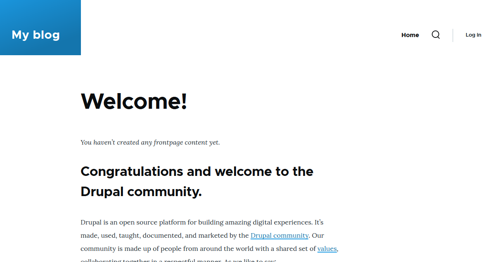

# Task 002 - Configure Auto Scaling


* Follow the instructions in the tutorial [Getting started with Amazon EC2 Auto Scaling](https://docs.aws.amazon.com/autoscaling/ec2/userguide/GettingStartedTutorial.html) to create a launch template.

* [CLI Documentation](https://docs.aws.amazon.com/cli/latest/reference/autoscaling/)

## Pre-requisites

* Networks (RTE-TABLE/SECURITY GROUP) set as at the end of the Labo2.
* 1 AMI of your Drupal instance
* 0 existing ec2 (even is in stopped state)
* 1 RDS Database instance - started
* 1 Elastic Load Balancer - started

NOTE : the following labo has been done through the GUI, but we've composed the commands for the first part.

## Create a new launch configuration. 

| Key                                       | Value                                  |
| :---------------------------------------- | :------------------------------------- |
| Name                                      | LT-DEVOPSTEAM18                        |
| Version                                   | v1.0.0                                 |
| Tag                                       | Name->same as template's name          |
| AMI                                       | Your Drupal AMI                        |
| Instance type                             | t3.micro (as usual)                    |
| Subnet                                    | Your subnet A                          |
| Security groups                           | Your Drupal Security Group             |
| IP Address assignation                    | Do not assign                          |
| Storage                                   | Only 10 Go Storage (based on your AMI) |
| Advanced Details/EC2 Detailed Cloud Watch | enable                                 |
| Purchase option/Request Spot instance     | disable                                |

\[INPUT\]

```bash
aws autoscaling create-launch-configuration \
--launch-configuration-name LT-DEVOPSTEAM18 \
--image-id ami-0cbfa1ad3da51e348 \
--instance-type t3.micro \
--security-groups sg-060333a9f2656e446 \
--no-associate-public-ip-address \
--block-device-mappings "[{\"DeviceName\":\"/dev/xvda\",\"Ebs\":{\"VolumeSize\":10}}]" \
--instance-monitoring Enabled=true
```

**Note**: CLIv2 is missing subnet and spot-instance parameters.

\[OUTPUT\]

**Note**: the command did not output anything. The `aws autoscaling describe-launch-configurations` 
command outputs the following information:

```json
{
    "LaunchConfigurationName": "LT-DEVOPSTEAM18",
    "LaunchConfigurationARN": "arn:aws:autoscaling:eu-west-3:709024702237:launchConfiguration:f85f1c1f-168d-4f3e-99f0-358103081550:launchConfigurationName/LT-DEVOPSTEAM18",
    "ImageId": "ami-0cbfa1ad3da51e348",
    "KeyName": "",
    "SecurityGroups": [
        "sg-060333a9f2656e446"
    ],
    "ClassicLinkVPCSecurityGroups": [],
    "UserData": "",
    "InstanceType": "t3.micro",
    "KernelId": "",
    "RamdiskId": "",
    "BlockDeviceMappings": [
        {
            "DeviceName": "/dev/xvda",
            "Ebs": {
                "VolumeSize": 10
            }
        }
    ],
    "InstanceMonitoring": {
        "Enabled": true
    },
    "CreatedTime": "2024-04-11T14:12:45.344000+00:00",
    "EbsOptimized": false,
    "AssociatePublicIpAddress": false
}
```

## Create an auto scaling group

* Choose launch template or configuration

| Specifications                | Key                                         | Value                                  |
| :---------------------------- | :------------------------------------------ |:-------------------------------------- |
| Launch Configuration          | Name                                        | ASGRP_DEVOPSTEAM18                     |
|                               | Launch configuration                        | Your launch configuration              |
| Instance launch option        | VPC                                         | Refer to infra schema                  |
|                               | AZ and subnet                               | AZs and subnets a + b                  |
| Advanced options              | Attach to an existing LB                    | Your ELB                               |
|                               | Target group                                | Your target group                      |
| Health check                  | Load balancing health check                 | Turn on                                |
|                               | health check grace period                   | 10 seconds                             |
| Additional settings           | Group metrics collection within Cloud Watch | Enable                                 |
|                               | Health check grace period                   | 10 seconds                             |
| Group size and scaling option | Desired capacity                            | 1                                      |
|                               | Min desired capacity                        | 1                                      |
|                               | Max desired capacity                        | 4                                      |
|                               | Policies                                    | Target tracking scaling policy         |
|                               | Target tracking scaling policy Name         | TTP_DEVOPSTEAM18                       |
|                               | Metric type                                 | Average CPU utilization                |
|                               | Target value                                | 50                                     |
|                               | Instance warmup                             | 30 seconds                             |
|                               | Instance maintenance policy                 | None                                   |
|                               | Instance scale-in protection                | None                                   |
|                               | Notification                                | None                                   |
| Add tag to instance           | Name                                        | AUTO_EC2_PRIVATE_DRUPAL_DEVOPSTEAM18   |

\[INPUT\]

```bash
aws autoscaling create-auto-scaling-group \
--auto-scaling-group-name ASGRP_DEVOPSTEAM18 \
--launch-configuration-name LT-DEVOPSTEAM18 \
--vpc-zone-identifier subnet-04a2fc4d8de790824,subnet-0bd3b8cdf25b8042e \
--traffic-sources Identifier=arn:aws:elasticloadbalancing:eu-west-3:709024702237:loadbalancer/app/ELB-DEVOPSTEAM18/3e4bba27bd1aeeff,Type=elbv2 \
--target-group-arns arn:aws:elasticloadbalancing:eu-west-3:709024702237:targetgroup/TG-DEVOPSTEAM18/99ff61700d72e152 \
--health-check-type ELB \
--health-check-grace-period 10 \
--desired-capacity 1 \
--min-size 1 \
--max-size 4 \
--default-instance-warmup 30 \
--instance-maintenance-policy '{"MinHealthyPercentage": -1, "MaxHealthyPercentage": -1}' \
--no-new-instances-protected-from-scale-in
```

\[OUTPUT\]
```bash
```

Creation of the autoscaling policy

\[INPUT\]
```bash
aws autoscaling put-scaling-policy
--auto-scaling-group-name ASGRP_DEVOPSTEAM18
--policy-name TTP_DEVOPSTEAM18
--policy-type TargetTrackingScaling
--target-tracking-configuration '{"TargetValue": 50.0, "PredefinedMetricSpecification": {"PredefinedMetricType": "ASGAverageCPUUtilization"}}'
```

\[OUTPUT\]
```bash
```

* Result expected

The first instance is launched automatically an IP that needs to be retrieved. 
here : 10.0.18.132

\[INPUT\]
```
ssh devopsteam18@15.188.43.46 -i ~/.ssh/CLD_KEY_DMZ_DEVOPSTEAM18.pem -Nv \
                            -L 1337:10.0.18.132:22 \
                            -L 8080:10.0.18.132:8080
ssh bitnami@localhost -p 1337 -i .ssh/CLD_KEY_DRUPAL_DEVOPSTEAM18.pem
```

both ssh and http access work


