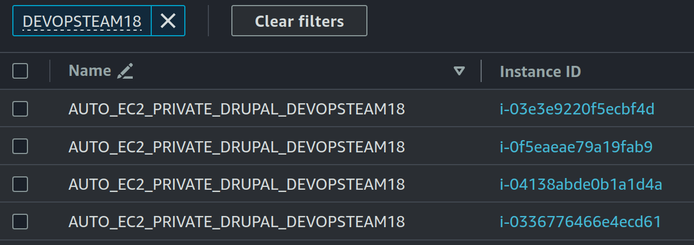

# Task 003 - Test and validate the elasticity


## Simulate heavy load to trigger a scaling action

* [Install the package "stress" on your Drupal instance](https://www.geeksforgeeks.org/linux-stress-command-with-examples/)

* [Install the package htop on your Drupal instance](https://www.geeksforgeeks.org/htop-command-in-linux-with-examples/)

* Check how many vCPU are available (with htop command)

```bash
sudo apt-get update && sudo apt-get -y install stress htop
```

\[INPUT\]

```bash
htop
```

\[OUTPUT\]

```bash
    0[                                                        0.0%]   Tasks: 30, 410 thr; 1 running
    1[|                                                       0.7%]   Load average: 0.01 0.01 0.00 
  Mem[|||||||||||||||||||||||||||||||||||||||||||||||||||270M/951M]   Uptime: 01:56:51
  Swp[|                                                 3.00M/635M]
```

### Stress your instance

\[INPUT\]

```bash
stress --cpu 2
```

[OUTPUT]

```bash
    0[|||||||||||||||||||||||||||||||||100.0%]   Tasks: 33, 410 thr; 2 running
    1[|||||||||||||||||||||||||||||||||100.0%]   Load average: 0.16 0.03 0.01 
  Mem[||||||||||||||||||||||||||||||273M/951M]   Uptime: 02:46:27
  Swp[|                            1.75M/635M]

    PID USER      PRI  NI  VIRT   RES   SHR S CPU%▽MEM%   TIME+  Command
   2713 bitnami    20   0  3684    96     0 R 100.  0.0  0:09.40 stress --cpu 2
```

* (Scale-IN) Observe the autoscaling effect on your infa

```
[INPUT]
//Screen shot from cloud watch metric
```


```
//TODO screenshot of ec2 instances list (running state)
```


\[INPUT\]

```bash
// Query instances belonging to the autoscaling group ASGRP_DEVOPSTEAM18
aws ec2 describe-instances --filters "Name=tag:aws:autoscaling:groupName,Values=ASGRP_DEVOPSTEAM18" --query "Reservations[*].Instances[*].{Instance:InstanceId,AZ:Placement.AvailabilityZone}" --output table
```

\[OUTPUT\]
```bash
---------------------------------------
|          DescribeInstances          |
+-------------+-----------------------+
|     AZ      |       Instance        |
+-------------+-----------------------+
|  eu-west-3a |  i-03e3e9220f5ecbf4d  |
|  eu-west-3a |  i-0f5eaeae79a19fab9  |
|  eu-west-3b |  i-04138abde0b1a1d4a  |
|  eu-west-3b |  i-0336776466e4ecd61  |
+-------------+-----------------------+
```

**Activity history**


**Alarm high statistics**


* (Scale-OUT) As soon as all 4 instances have started, end stress on the main machine.

[Change the default cooldown period](https://docs.aws.amazon.com/autoscaling/ec2/userguide/ec2-auto-scaling-scaling-cooldowns.html)

** CloudWatch CPU metrics after cooldown**


** EC2 instances list after cooldown**


## Delivery

Inform your teacher of the deliverable on the repository (link to the commit to retrieve)