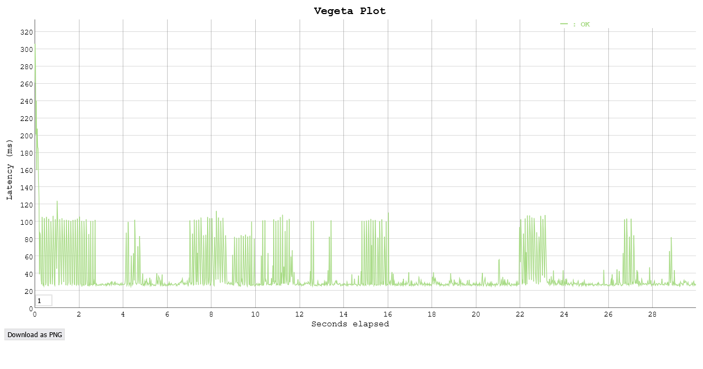
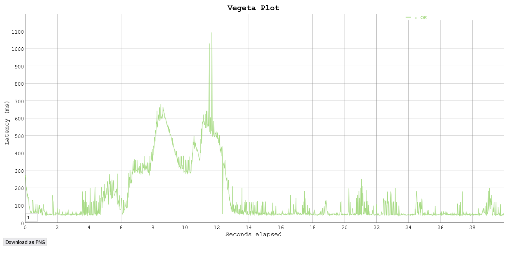
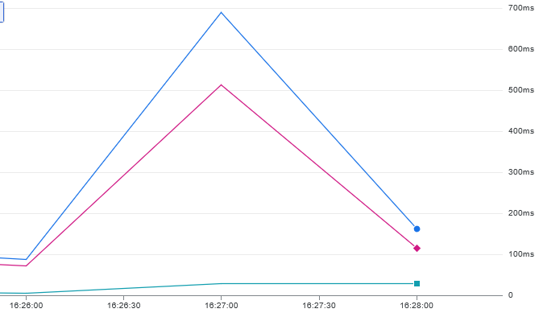
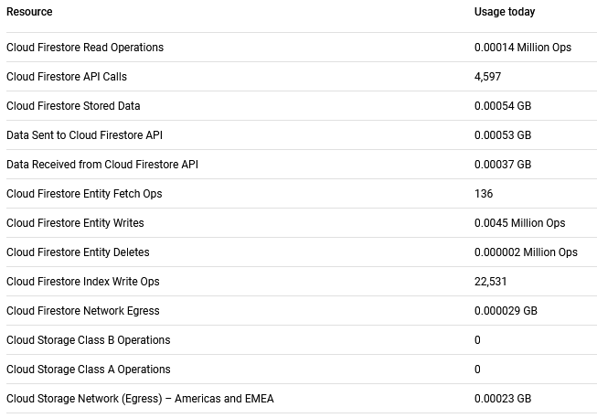

## Task 3: Test the performance of Datastore writes

In this task you will performance test the App Engine platform with a
load generator. You will compare the performance of normal request
processing and request processing that involves Datastore write
operations.

As the Servlets are deployed with Automatic Scaling, there is a danger
of consuming a lot of resources while testing, and burning through a
lot of money. Google gave you a coupon with some money that was put
into a billing account. Projects can have spending limits, but by
default it is unlimited. Before starting the performance test, you
have to set a reasonable daily spending limit.

Set a daily spending limit on the project as follows:

- In the Cloud Platform console navigate to **App Engine** >
  **Settings**. Click on **Edit**. Enter a daily spending limit of
  **$1.00**. (Note: Google has removed this functionality in January 2020. There is no replacement for it yet. Skip this step, but observe how many credits you have left before and after the performance tests. You can also limit the number of instances with an optional configuration of the autoscaling algorithm: In the file `appengine-web.xml` in the `<automatic-scaling>` element add a `<max-instances>` element with a small value (3, 4, ...). See <https://cloud.google.com/appengine/docs/standard/java/config/appref#scaling_elements>. An alternative is to use **Budgets & alerts**. In the Cloud Platform console navigate to **Billing** > **Budgets & alerts**. Create a new budget for the month for an amount of **$1.00** and optionally set the actions associated with the alert.)

Conduct the performance tests as follows:

1. You should already have vegeta installed from previous labs. If not, see <https://blog.absyah.dev/super-simple-guide-for-load-testing-using-vegeta#heading-install-vegeta>.

2. First test the performance of normal request processing using the
   Servlet generated by the wizard.

   - Prepare an "attack" using vegeta.

   - In the App Engine console open the **Dashboard**.

   - Run the attack.

   - In the dashboard observe the graph of the incoming requests, the
     number of instances and the latency.

3. Test the performance of the Servlet that writes to the Datastore.

4. At the end of the tests observe in detail how much resources were
   used. In the console click on **Quota Details**.

5. If you are running out of resources because of the monthly spending
   limit, increase it carefully by a dollar or two.

Deliverables:


- For each performance test, write the command used to generate the attack with vegeta and copy the file generated by the vegeta plot command.

  ```bash
  # Setup
  OUT="./deliverables"
  URL="https://20240425t154831-dot-acquired-badge-420715.ew.r.appspot.com"
  DURATION="30s"

  mkdir -p $OUT
  pushd $OUT

  # Test the `hello` servlet
  echo "GET $URL/hello" | vegeta attack -duration=$DURATION | tee result_hello.bin | vegeta plot > plot_hello.html

  # Test the `datastorewrite` servlet
  PARAMS="_kind=book&author=Ray%20J.%20Rafaels&title=Cloud%20Computing%3A%20From%20Beginning%20to%20End"
  echo "GET $URL/datastorewrite?$PARAMS" | vegeta attack -duration=$DURATION | tee result_datastorewrite.bin | vegeta plot > plot_datastorewrite.html

  popd
  ```

  Attack plots:
  - 
  - 
 
- What response times do you observe for each Servlet?

  ```
  For the `hello` servlet, the response time varies between 50 ms and 450 ms. The average response time is around 200 ms.

  For the `datastorewrite` servlet, the response time varies between 100 ms and 200ms with a noticeable large spike at 1100 ms. The average response time is not inferable from the plot, but it is significantly higher than the `hello` servlet.
  ```

- Compare the response times shown by vegeta with the App Engine
  console. Explain the difference.



```
The App Engine displays as for 50 percentile (median) a value of ~29ms latency for the largest spike during the datastore attack while the 99 percentile is at ~700ms at the same time.
This is noticeably smaller than vegeta times, as it registers only the time for the servlet to answer, not taking response time into account as vegeta does.
```

- How many resources have you used to run these tests? From the
  **Quota Details** view of the console determine the non-zero resource
  quotas (**Daily quota** different from 0%). Explain each with a sentence.
  To get a sense of everything that is measured click on **Show resources not in use**.



```
As we've run three sets of tests back to back those number are not representative of a single test, but rather the 3 of them.

Cloud Firestore Read Operations : The total number of Read operations
Cloud Firestore API Calls : The total number of API calls used for reading, writing data, deleting, querying documents, etc
Cloud Firestore Stored Data : Total amount of data stored in datastore entities and corresponding indexes. It may incur significant overhead due to metadata fields required.
Data Sent to Cloud Firestore API : Total amount of data sent by the application to the Cloud Firestore
Data Received from Cloud Firestore API : Total amount of data received by the application from the Cloud Firestore as answers from the API calls (see above)
Cloud Firestore Entity Fetch Ops : Number of read operations to fetch documents (entities) from Cloud Firestore. It is surprisingly slower, we may infer that a cache system is in place.
Cloud Firestore Entity Writes : Number of write operations to update documents in Cloud Firestore.
Cloud Firestore Entity Deletes : Number of delete operations to remove documents in Cloud Firestore. It is considerably low as well as its presence is due to manual operations done on the data.
Cloud Firestore Index Write Ops : Number of write operations effected on Cloud Firestore indexes. Of note : every time an entity is updated (written) its index is updated.
Cloud Firestore Network Egress : Total amount of outbound traffic of data from cloud firestore to the application/other services
Cloud Storage Network (Egress) – Americas and EMEA : Total amount of data transferred out of cloud firestore to external networks, services, such as cloud storage.
```

- Let's suppose you become suspicious that the algorithm for the automatic scaling of
  instances is not working correctly. Imagine a way in which the algorithm could be broken. Which measures shown in the console would you use to detect this failure?

```
Inspecting conspicuous data would be a good way to detect it. 
Setting up alarms or triggers to ensure things follow the plan is advised.
- Instance count should vary in size, both growing and shrinking.
- Request Latency should be kept under reasonable time.
- CPU/RAM usage should be as optimised as possible, aiming to be as useful as needed without turning into a bottleneck.
- Request count should be split evenly among instances to avoid overburdening one.
```

## Troubleshooting

If your Servlet that writes to the Datastore works OK on your local
machine, but you get a server error when running it in the Google
cloud, have a look at the logs (hamburger menu > Logs). If you see a
NoClassDefFoundError related to the Datastore you have run into a
[problem that was reported to Google on March 22, 2018](https://issuetracker.google.com/issues/76144204). The
problem is that the library for the Datastore,
`appengine-api-1.0-sdk`, is missing. Previously it was automatically
included by Google.

Here is a workaround:

- Create a new project (Google App Engine Standard Environment) that
  has Maven activated (option on the first screen of the wizard).
- Edit the file `pom.xml`: In the dependency declaration for
  `appengine-api-1.0-sdk` change the scope from `provided` to
  `compile` (this will include the dependency in the jar that is
  uploaded to Google).
- _Clean_ the project.
