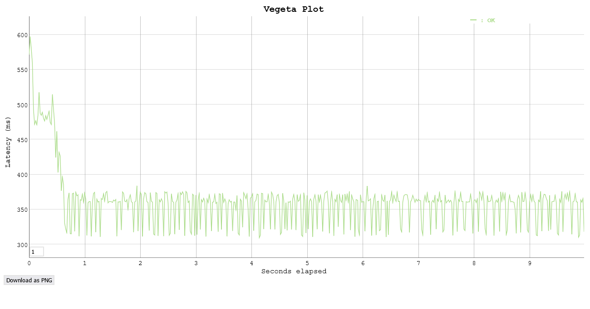

# Task 3 - Add and exercise resilience

By now you should have understood the general principle of configuring, running and accessing applications in Kubernetes. However, the above application has no support for resilience. If a container (resp. Pod) dies, it stops working. Next, we add some resilience to the application.

## Subtask 3.1 - Add Deployments

In this task you will create Deployments that will spawn Replica Sets as health-management components.

Converting a Pod to be manag  * Create Deployment versions of your application configurations (e.g. `redis-deploy.yaml` instead of `redis-pod.yaml`) and modify/extend them to contain the required Deployment parameters.
ed by a Deployment is quite simple.

  * Have a look at an example of a Deployment described here: <https://kubernetes.io/docs/concepts/workloads/controllers/deployment/>

  * Create Deployment versions of your application configurations (e.g. `redis-deploy.yaml` instead of `redis-pod.yaml`) and modify/extend them to contain the required Deployment parameters.

  * Again, be careful with the YAML indentation!

  * Make sure to have always 2 instances of the API and Frontend running. 

  * Use only 1 instance for the Redis-Server. Why?

    ```txt
    Having a single database is easier to manage because we don't have to set up clustering and worry about data consistency between instances.
    
    A common problem with multiple instances of a database is that they can get out of sync, which can lead to data corruption.
    ```

  * Delete all application Pods (using `kubectl delete pod ...`) and replace them with deployment versions.

    ```sh
    kubectl delete pods --all
    kubectl create -f redis-deploy.yaml -f api-deploy.yaml -f frontend-deploy.yaml
    ```

  * Verify that the application is still working and the Replica Sets are in place. (`kubectl get all`, `kubectl get pods`, `kubectl describe ...`)

    ```sh
    kubectl get all
    ```

    ```txt
    NAME                                       READY   STATUS    RESTARTS       AGE
    pod/api-deployment-664fbdf7d9-l8v75        1/1     Running   2 (5m8s ago)   5m17s
    pod/api-deployment-664fbdf7d9-v7csc        1/1     Running   1 (5m9s ago)   5m17s
    pod/frontend-deployment-67879ff5df-ckg9p   1/1     Running   0              5m17s
    pod/frontend-deployment-67879ff5df-rxd78   1/1     Running   0              5m17s
    pod/redis-deployment-56fb88dd96-sfcxp      1/1     Running   0              5m18s

    NAME                   TYPE           CLUSTER-IP      EXTERNAL-IP      PORT(S)        AGE
    service/api-svc        ClusterIP      10.93.118.108   <none>           8081/TCP       45m
    service/frontend-svc   LoadBalancer   10.93.118.40    35.203.183.244   80:31606/TCP   45m
    service/kubernetes     ClusterIP      10.93.112.1     <none>           443/TCP        56m
    service/redis-svc      ClusterIP      10.93.125.179   <none>           6379/TCP       45m

    NAME                                  READY   UP-TO-DATE   AVAILABLE   AGE
    deployment.apps/api-deployment        2/2     2            2           5m19s
    deployment.apps/frontend-deployment   2/2     2            2           5m18s
    deployment.apps/redis-deployment      1/1     1            1           5m19s

    NAME                                             DESIRED   CURRENT   READY   AGE
    replicaset.apps/api-deployment-664fbdf7d9        2         2         2       5m19s
    replicaset.apps/frontend-deployment-67879ff5df   2         2         2       5m19s
    replicaset.apps/redis-deployment-56fb88dd96      1         1         1       5m20s
    ```
    

## Subtask 3.2 - Verify the functionality of the Replica Sets

In this subtask you will intentionally kill (delete) Pods and verify that the application keeps working and the Replica Set is doing its task.

Hint: You can monitor the status of a resource by adding the `--watch` option to the `get` command. To watch a single resource:

```sh
$ kubectl get <resource-name> --watch
```

To watch all resources of a certain type, for example all Pods:

```sh
$ kubectl get pods --watch
```

You may also use `kubectl get all` repeatedly to see a list of all resources.  You should also verify if the application stays available by continuously reloading your browser window.

* What happens if you delete a Frontend or API Pod? How long does it take for the system to react?

  ```sh
  $ kubectl delete pod [pod name (for ex : api-deployment-664fbdf7d9-drjh5]
  ```

  ```txt
  When deleting a pod, the deployment immediately creates a new one to replace it in order to maintain the desired number of replicas.

  It takes about 3 seconds for a new container to be created and go through the `Pending -> Running` phases. During that time, the frontend and the API behaves just like expected.

  When both frontend pods are deleted, the app becomes unavailable for a few seconds until the new pods are running and operations can resume normally.
  ```

* What happens when you delete the Redis Pod?

  ```
  Any past data in the DB is lost because there is only a single instance of redis running (the data is not replicated in another instance) and no persistent volume is set up.
  ```
  
* How can you change the number of instances temporarily to 3? Hint: look for scaling in the deployment documentation

  ```sh
  $ kubectl scale --replicas=3 deployment/api-deployment
  ```
  
* What autoscaling features are available? Which metrics are used?

  ```txt
  There are 3 common autoscaling options:
  - Horizontal Pod Autoscaler (HPA): automatically scales the number of pods in a replication controller, deployment, replica set, or stateful set based on observed CPU utilization. By default, it scales based on the average CPU utilization of all pods and queries the metrics server every 15 seconds. Note that a minimal and maximal number of replicas may be set.
  - Vertical Pod Autoscaler (VPA): automatically adjusts the CPU and memory reservations of the pods (this doesn't come wiht k8s by default, it must be installed). By default, it is also based on the average CPU utilization of all pods.
  - Cluster Autoscaler: This feature automatically adjusts the size of the Kubernetes cluster when there are failed pods in the cluster due to insufficient resources or some nodes in the cluster are underutilized for an extended period of time and it is possible to regroup pods in less nodes.

  The metrics used are divided in three categories:
  - Resource metrics: CPU and memory usage of the pods.
  - Custom metrics: app-specific metrics defined based on the behavior of the application.
  - External metrics: metrics from an external system that are unrelated to the k8s objects but on which the cluster depends. 
  ```
  
* How can you update a component? (see "Updating a Deployment" in the deployment documentation)

  ```sh
  $ kubectl edit deployment/api-deployment --save-config # Opens the default editor with the configuration file. Saving will run kubectl --apply on the object.
  ```

## Subtask 3.3 - Put autoscaling in place and load-test it

On the GKE cluster deploy autoscaling on the Frontend with a target CPU utilization of 30% and number of replicas between 1 and 4. 

```sh
$ kubectl autoscale deployment/frontend-deployment --min=1 --max=4 --cpu-percent=30
```

Load-test using Vegeta (500 requests should be enough).

```bash
OUT="./plots"
URL="http://35.203.183.244"
DURATION="10s" # Default vegeta rate is 50/second so 500 requests will take 10 seconds

mkdir -p $OUT
pushd $OUT

# Test the `all` endpoint
echo "GET $URL/all" | \
  vegeta attack -duration=$DURATION | \
  tee result_all.bin | \
  vegeta plot > plot_all.html

# Test the /api/todos endpoint
PARAMS='{"isComplete":false,"label":"Ducky"}' 

jq -ncM "while(true; .+1) | {method: 'POST', url: '${URL}/api/todos', body: ${PARAMS} | @base64 }" | \
  vegeta attack -duration=$DURATION | \
  tee result_todos.bin | \
  vegeta plot > plot_todos.html

popd
```

> [!NOTE]
>
> - The autoscale may take a while to trigger.
>
> - If your autoscaling fails to get the cpu utilization metrics, run the following command
>
>   - ```sh
>     $ kubectl apply -f https://github.com/kubernetes-sigs/metrics-server/releases/latest/download/components.yaml
>     ```
>
>   - Then add the *resources* part in the *container part* in your `frontend-deploy` :
>
>   - ```yaml
>     spec:
>       containers:
>         - ...:
>           env:
>             - ...:
>           resources:
>             requests:
>               cpu: 10m
>     ```
>

## Deliverables

Document your observations in the lab report. Document any difficulties you faced and how you overcame them. Copy the object descriptions into the lab report.

```
Nous observons sur le graphe ci-dessous qu'une forte latence est observée au début de l'attaque avant de redescendre, une fois les replicas créées. 
La latence se stabilise à 350ms et ne connaît pas de latence majeure.
```



```````sh
// TODO autoscaling describe
```````

```yaml
$ kubectl describe all
Name:             api-deployment-664fbdf7d9-6zm66
Namespace:        default
Priority:         0
Service Account:  default
Node:             gke-gke-cluster-1-default-pool-fee6c77f-f46f/10.138.0.4
Start Time:       Fri, 17 May 2024 10:36:09 +0200
Labels:           app=todo
                  component=api
                  pod-template-hash=664fbdf7d9
Annotations:      <none>
Status:           Running
IP:               10.36.1.19
IPs:
  IP:           10.36.1.19
Controlled By:  ReplicaSet/api-deployment-664fbdf7d9
Containers:
  api:
    Container ID:   containerd://ae450c7392d2c9a73ba12a413f556cb12107f437a029616574281e2b76fe9268
    Image:          icclabcna/ccp2-k8s-todo-api
    Image ID:       docker.io/icclabcna/ccp2-k8s-todo-api@sha256:13cb50bc9e93fdf10b4608f04f2966e274470f00c0c9f60815ec8fc987cd6e03
    Port:           8081/TCP
    Host Port:      0/TCP
    State:          Running
      Started:      Fri, 17 May 2024 10:36:11 +0200
    Ready:          True
    Restart Count:  0
    Environment:
      REDIS_ENDPOINT:  redis-svc
      REDIS_PWD:       ccp2
    Mounts:
      /var/run/secrets/kubernetes.io/serviceaccount from kube-api-access-jstdx (ro)
Conditions:
  Type              Status
  Initialized       True
  Ready             True
  ContainersReady   True
  PodScheduled      True
Volumes:
  kube-api-access-jstdx:
    Type:                    Projected (a volume that contains injected data from multiple sources)
    TokenExpirationSeconds:  3607
    ConfigMapName:           kube-root-ca.crt
    ConfigMapOptional:       <nil>
    DownwardAPI:             true
QoS Class:                   BestEffort
Node-Selectors:              <none>
Tolerations:                 node.kubernetes.io/not-ready:NoExecute op=Exists for 300s
                             node.kubernetes.io/unreachable:NoExecute op=Exists for 300s
Events:                      <none>


Name:             api-deployment-664fbdf7d9-bhgfs
Namespace:        default
Priority:         0
Service Account:  default
Node:             gke-gke-cluster-1-default-pool-fee6c77f-cqn3/10.138.0.3
Start Time:       Fri, 17 May 2024 10:36:09 +0200
Labels:           app=todo
                  component=api
                  pod-template-hash=664fbdf7d9
Annotations:      <none>
Status:           Running
IP:               10.36.0.28
IPs:
  IP:           10.36.0.28
Controlled By:  ReplicaSet/api-deployment-664fbdf7d9
Containers:
  api:
    Container ID:   containerd://9f4b0ccdf311f61daf481c0df959a352232b6ef93d5302f18aba315d7b1bfcf5
    Image:          icclabcna/ccp2-k8s-todo-api
    Image ID:       docker.io/icclabcna/ccp2-k8s-todo-api@sha256:13cb50bc9e93fdf10b4608f04f2966e274470f00c0c9f60815ec8fc987cd6e03
    Port:           8081/TCP
    Host Port:      0/TCP
    State:          Running
      Started:      Fri, 17 May 2024 10:36:12 +0200
    Ready:          True
    Restart Count:  0
    Environment:
      REDIS_ENDPOINT:  redis-svc
      REDIS_PWD:       ccp2
    Mounts:
      /var/run/secrets/kubernetes.io/serviceaccount from kube-api-access-548j6 (ro)
Conditions:
  Type              Status
  Initialized       True
  Ready             True
  ContainersReady   True
  PodScheduled      True
Volumes:
  kube-api-access-548j6:
    Type:                    Projected (a volume that contains injected data from multiple sources)
    TokenExpirationSeconds:  3607
    ConfigMapName:           kube-root-ca.crt
    ConfigMapOptional:       <nil>
    DownwardAPI:             true
QoS Class:                   BestEffort
Node-Selectors:              <none>
Tolerations:                 node.kubernetes.io/not-ready:NoExecute op=Exists for 300s
                             node.kubernetes.io/unreachable:NoExecute op=Exists for 300s
Events:                      <none>


Name:             frontend-deployment-67879ff5df-j6nh9
Namespace:        default
Priority:         0
Service Account:  default
Node:             gke-gke-cluster-1-default-pool-fee6c77f-f46f/10.138.0.4
Start Time:       Fri, 17 May 2024 09:41:47 +0200
Labels:           app=todo
                  component=frontend
                  pod-template-hash=67879ff5df
Annotations:      <none>
Status:           Running
IP:               10.36.1.18
IPs:
  IP:           10.36.1.18
Controlled By:  ReplicaSet/frontend-deployment-67879ff5df
Containers:
  frontend:
    Container ID:   containerd://0cd73c7dc3cb9988555b17715062e19615bedd5561ae542856f28243a4383772
    Image:          icclabcna/ccp2-k8s-todo-frontend
    Image ID:       docker.io/icclabcna/ccp2-k8s-todo-frontend@sha256:5892b8f75a4dd3aa9d9cf527f8796a7638dba574ea8e6beef49360a3c67bbb44
    Port:           8080/TCP
    Host Port:      0/TCP
    State:          Running
      Started:      Fri, 17 May 2024 09:41:49 +0200
    Ready:          True
    Restart Count:  0
    Environment:
      API_ENDPOINT_URL:  http://api-svc:8081
    Mounts:
      /var/run/secrets/kubernetes.io/serviceaccount from kube-api-access-74p78 (ro)
Conditions:
  Type              Status
  Initialized       True
  Ready             True
  ContainersReady   True
  PodScheduled      True
Volumes:
  kube-api-access-74p78:
    Type:                    Projected (a volume that contains injected data from multiple sources)
    TokenExpirationSeconds:  3607
    ConfigMapName:           kube-root-ca.crt
    ConfigMapOptional:       <nil>
    DownwardAPI:             true
QoS Class:                   BestEffort
Node-Selectors:              <none>
Tolerations:                 node.kubernetes.io/not-ready:NoExecute op=Exists for 300s
                             node.kubernetes.io/unreachable:NoExecute op=Exists for 300s
Events:                      <none>


Name:             frontend-deployment-67879ff5df-sfcgf
Namespace:        default
Priority:         0
Service Account:  default
Node:             gke-gke-cluster-1-default-pool-fee6c77f-cqn3/10.138.0.3
Start Time:       Fri, 17 May 2024 09:41:47 +0200
Labels:           app=todo
                  component=frontend
                  pod-template-hash=67879ff5df
Annotations:      <none>
Status:           Running
IP:               10.36.0.26
IPs:
  IP:           10.36.0.26
Controlled By:  ReplicaSet/frontend-deployment-67879ff5df
Containers:
  frontend:
    Container ID:   containerd://98ac138dcda95f32a206b2be58b5a969f427f765c7faeb0a70bccfc7b73924a4
    Image:          icclabcna/ccp2-k8s-todo-frontend
    Image ID:       docker.io/icclabcna/ccp2-k8s-todo-frontend@sha256:5892b8f75a4dd3aa9d9cf527f8796a7638dba574ea8e6beef49360a3c67bbb44
    Port:           8080/TCP
    Host Port:      0/TCP
    State:          Running
      Started:      Fri, 17 May 2024 09:41:49 +0200
    Ready:          True
    Restart Count:  0
    Environment:
      API_ENDPOINT_URL:  http://api-svc:8081
    Mounts:
      /var/run/secrets/kubernetes.io/serviceaccount from kube-api-access-7qnxl (ro)
Conditions:
  Type              Status
  Initialized       True
  Ready             True
  ContainersReady   True
  PodScheduled      True
Volumes:
  kube-api-access-7qnxl:
    Type:                    Projected (a volume that contains injected data from multiple sources)
    TokenExpirationSeconds:  3607
    ConfigMapName:           kube-root-ca.crt
    ConfigMapOptional:       <nil>
    DownwardAPI:             true
QoS Class:                   BestEffort
Node-Selectors:              <none>
Tolerations:                 node.kubernetes.io/not-ready:NoExecute op=Exists for 300s
                             node.kubernetes.io/unreachable:NoExecute op=Exists for 300s
Events:                      <none>


Name:             redis-deployment-56fb88dd96-sfcxp
Namespace:        default
Priority:         0
Service Account:  default
Node:             gke-gke-cluster-1-default-pool-fee6c77f-f46f/10.138.0.4
Start Time:       Thu, 16 May 2024 17:22:48 +0200
Labels:           app=todo
                  component=redis
                  pod-template-hash=56fb88dd96
Annotations:      <none>
Status:           Running
IP:               10.36.1.14
IPs:
  IP:           10.36.1.14
Controlled By:  ReplicaSet/redis-deployment-56fb88dd96
Containers:
  redis:
    Container ID:  containerd://0544c7cc48696726baa7daf83d1652e611f3a281e8edfac9a7a867f5fa3ab6dd
    Image:         redis
    Image ID:      docker.io/library/redis@sha256:5a93f6b2e391b78e8bd3f9e7e1e1e06aeb5295043b4703fb88392835cec924a0
    Port:          6379/TCP
    Host Port:     0/TCP
    Args:
      redis-server
      --requirepass ccp2
      --appendonly yes
    State:          Running
      Started:      Thu, 16 May 2024 17:22:59 +0200
    Ready:          True
    Restart Count:  0
    Environment:    <none>
    Mounts:
      /var/run/secrets/kubernetes.io/serviceaccount from kube-api-access-cpjmp (ro)
Conditions:
  Type              Status
  Initialized       True
  Ready             True
  ContainersReady   True
  PodScheduled      True
Volumes:
  kube-api-access-cpjmp:
    Type:                    Projected (a volume that contains injected data from multiple sources)
    TokenExpirationSeconds:  3607
    ConfigMapName:           kube-root-ca.crt
    ConfigMapOptional:       <nil>
    DownwardAPI:             true
QoS Class:                   BestEffort
Node-Selectors:              <none>
Tolerations:                 node.kubernetes.io/not-ready:NoExecute op=Exists for 300s
                             node.kubernetes.io/unreachable:NoExecute op=Exists for 300s
Events:                      <none>


Name:              api-svc
Namespace:         default
Labels:            component=api
Annotations:       cloud.google.com/neg: {"ingress":true}
Selector:          app=todo,component=api
Type:              ClusterIP
IP Family Policy:  SingleStack
IP Families:       IPv4
IP:                10.93.118.108
IPs:               10.93.118.108
Port:              api  8081/TCP
TargetPort:        8081/TCP
Endpoints:         10.36.0.28:8081,10.36.1.19:8081
Session Affinity:  None
Events:            <none>


Name:                     frontend-svc
Namespace:                default
Labels:                   component=frontend
Annotations:              cloud.google.com/neg: {"ingress":true}
Selector:                 app=todo,component=frontend
Type:                     LoadBalancer
IP Family Policy:         SingleStack
IP Families:              IPv4
IP:                       10.93.118.40
IPs:                      10.93.118.40
LoadBalancer Ingress:     35.203.183.244
Port:                     frontend  80/TCP
TargetPort:               8080/TCP
NodePort:                 frontend  31606/TCP
Endpoints:                10.36.0.26:8080,10.36.1.18:8080
Session Affinity:         None
External Traffic Policy:  Cluster
Events:                   <none>


Name:              kubernetes
Namespace:         default
Labels:            component=apiserver
                   provider=kubernetes
Annotations:       cloud.google.com/neg: {"ingress":true}
Selector:          <none>
Type:              ClusterIP
IP Family Policy:  SingleStack
IP Families:       IPv4
IP:                10.93.112.1
IPs:               10.93.112.1
Port:              https  443/TCP
TargetPort:        443/TCP
Endpoints:         10.138.0.2:443
Session Affinity:  None
Events:            <none>


Name:              redis-svc
Namespace:         default
Labels:            component=redis
Annotations:       cloud.google.com/neg: {"ingress":true}
Selector:          app=todo,component=redis
Type:              ClusterIP
IP Family Policy:  SingleStack
IP Families:       IPv4
IP:                10.93.125.179
IPs:               10.93.125.179
Port:              redis  6379/TCP
TargetPort:        6379/TCP
Endpoints:         10.36.1.14:6379
Session Affinity:  None
Events:            <none>


Name:                   api-deployment
Namespace:              default
CreationTimestamp:      Thu, 16 May 2024 17:22:48 +0200
Labels:                 app=todo
                        component=api
Annotations:            deployment.kubernetes.io/revision: 1
Selector:               app=todo,component=api
Replicas:               2 desired | 2 updated | 2 total | 2 available | 0 unavailable
StrategyType:           RollingUpdate
MinReadySeconds:        0
RollingUpdateStrategy:  25% max unavailable, 25% max surge
Pod Template:
  Labels:  app=todo
           component=api
  Containers:
   api:
    Image:      icclabcna/ccp2-k8s-todo-api
    Port:       8081/TCP
    Host Port:  0/TCP
    Environment:
      REDIS_ENDPOINT:  redis-svc
      REDIS_PWD:       ccp2
    Mounts:            <none>
  Volumes:             <none>
Conditions:
  Type           Status  Reason
  ----           ------  ------
  Progressing    True    NewReplicaSetAvailable
  Available      True    MinimumReplicasAvailable
OldReplicaSets:  <none>
NewReplicaSet:   api-deployment-664fbdf7d9 (2/2 replicas created)
Events:          <none>


Name:                   frontend-deployment
Namespace:              default
CreationTimestamp:      Thu, 16 May 2024 17:22:49 +0200
Labels:                 app=todo
                        component=frontend
Annotations:            deployment.kubernetes.io/revision: 1
Selector:               app=todo,component=frontend
Replicas:               2 desired | 2 updated | 2 total | 2 available | 0 unavailable
StrategyType:           RollingUpdate
MinReadySeconds:        0
RollingUpdateStrategy:  25% max unavailable, 25% max surge
Pod Template:
  Labels:  app=todo
           component=frontend
  Containers:
   frontend:
    Image:      icclabcna/ccp2-k8s-todo-frontend
    Port:       8080/TCP
    Host Port:  0/TCP
    Environment:
      API_ENDPOINT_URL:  http://api-svc:8081
    Mounts:              <none>
  Volumes:               <none>
Conditions:
  Type           Status  Reason
  ----           ------  ------
  Progressing    True    NewReplicaSetAvailable
  Available      True    MinimumReplicasAvailable
OldReplicaSets:  <none>
NewReplicaSet:   frontend-deployment-67879ff5df (2/2 replicas created)
Events:          <none>


Name:                   redis-deployment
Namespace:              default
CreationTimestamp:      Thu, 16 May 2024 17:22:48 +0200
Labels:                 app=todo
                        component=redis
Annotations:            deployment.kubernetes.io/revision: 1
Selector:               app=todo,component=redis
Replicas:               1 desired | 1 updated | 1 total | 1 available | 0 unavailable
StrategyType:           RollingUpdate
MinReadySeconds:        0
RollingUpdateStrategy:  25% max unavailable, 25% max surge
Pod Template:
  Labels:  app=todo
           component=redis
  Containers:
   redis:
    Image:      redis
    Port:       6379/TCP
    Host Port:  0/TCP
    Args:
      redis-server
      --requirepass ccp2
      --appendonly yes
    Environment:  <none>
    Mounts:       <none>
  Volumes:        <none>
Conditions:
  Type           Status  Reason
  ----           ------  ------
  Available      True    MinimumReplicasAvailable
  Progressing    True    NewReplicaSetAvailable
OldReplicaSets:  <none>
NewReplicaSet:   redis-deployment-56fb88dd96 (1/1 replicas created)
Events:          <none>


Name:           api-deployment-664fbdf7d9
Namespace:      default
Selector:       app=todo,component=api,pod-template-hash=664fbdf7d9
Labels:         app=todo
                component=api
                pod-template-hash=664fbdf7d9
Annotations:    deployment.kubernetes.io/desired-replicas: 2
                deployment.kubernetes.io/max-replicas: 3
                deployment.kubernetes.io/revision: 1
Controlled By:  Deployment/api-deployment
Replicas:       2 current / 2 desired
Pods Status:    2 Running / 0 Waiting / 0 Succeeded / 0 Failed
Pod Template:
  Labels:  app=todo
           component=api
           pod-template-hash=664fbdf7d9
  Containers:
   api:
    Image:      icclabcna/ccp2-k8s-todo-api
    Port:       8081/TCP
    Host Port:  0/TCP
    Environment:
      REDIS_ENDPOINT:  redis-svc
      REDIS_PWD:       ccp2
    Mounts:            <none>
  Volumes:             <none>
Events:                <none>


Name:           frontend-deployment-67879ff5df
Namespace:      default
Selector:       app=todo,component=frontend,pod-template-hash=67879ff5df
Labels:         app=todo
                component=frontend
                pod-template-hash=67879ff5df
Annotations:    deployment.kubernetes.io/desired-replicas: 2
                deployment.kubernetes.io/max-replicas: 3
                deployment.kubernetes.io/revision: 1
Controlled By:  Deployment/frontend-deployment
Replicas:       2 current / 2 desired
Pods Status:    2 Running / 0 Waiting / 0 Succeeded / 0 Failed
Pod Template:
  Labels:  app=todo
           component=frontend
           pod-template-hash=67879ff5df
  Containers:
   frontend:
    Image:      icclabcna/ccp2-k8s-todo-frontend
    Port:       8080/TCP
    Host Port:  0/TCP
    Environment:
      API_ENDPOINT_URL:  http://api-svc:8081
    Mounts:              <none>
  Volumes:               <none>
Events:                  <none>


Name:           redis-deployment-56fb88dd96
Namespace:      default
Selector:       app=todo,component=redis,pod-template-hash=56fb88dd96
Labels:         app=todo
                component=redis
                pod-template-hash=56fb88dd96
Annotations:    deployment.kubernetes.io/desired-replicas: 1
                deployment.kubernetes.io/max-replicas: 2
                deployment.kubernetes.io/revision: 1
Controlled By:  Deployment/redis-deployment
Replicas:       1 current / 1 desired
Pods Status:    1 Running / 0 Waiting / 0 Succeeded / 0 Failed
Pod Template:
  Labels:  app=todo
           component=redis
           pod-template-hash=56fb88dd96
  Containers:
   redis:
    Image:      redis
    Port:       6379/TCP
    Host Port:  0/TCP
    Args:
      redis-server
      --requirepass ccp2
      --appendonly yes
    Environment:  <none>
    Mounts:       <none>
  Volumes:        <none>
Events:           <none>


Name:                                                  frontend-deployment
Namespace:                                             default
Labels:                                                <none>
Annotations:                                           <none>
CreationTimestamp:                                     Sun, 19 May 2024 12:45:14 +0200
Reference:                                             Deployment/frontend-deployment
Metrics:                                               ( current / target )
  resource cpu on pods  (as a percentage of request):  <unknown> / 30%
Min replicas:                                          1
Max replicas:                                          4
Deployment pods:                                       2 current / 2 desired
Conditions:
  Type            Status  Reason                   Message
  ----            ------  ------                   -------
  AbleToScale     True    ReadyForNewScale         recommended size matches current size
  ScalingActive   False   FailedGetResourceMetric  the HPA was unable to compute the replica count: No recommendation
  ScalingLimited  False   DesiredWithinRange       the desired count is within the acceptable range
Events:
  Type     Reason                   Age                       From                       Message
  ----     ------                   ----                      ----                       -------
  Warning  FailedGetResourceMetric  4m20s (x1151 over 5h14m)  horizontal-pod-autoscaler  No recommendation
```

```yaml
# redis-deploy.yaml

apiVersion: apps/v1
kind: Deployment
metadata:
  name: redis-deployment
  labels:
    component: redis
    app: todo
spec:
  replicas: 1
  selector:
    matchLabels:
      component: redis
      app: todo
  template:
    metadata:
      labels:
        component: redis
        app: todo
    spec:
      containers:
      - name: redis
        image: redis
        ports:
        - containerPort: 6379
        args:
        - redis-server 
        - --requirepass ccp2 
        - --appendonly yes
```

```yaml
# api-deploy.yaml

apiVersion: apps/v1
kind: Deployment
metadata:
  name: api-deployment
  labels:
    component: api
    app: todo
spec:
  replicas: 2
  selector:
    matchLabels:
      component: api
      app: todo
  template:
    metadata:
      labels:
        component: api
        app: todo
    spec:
      containers:
      - name: api
        image: icclabcna/ccp2-k8s-todo-api
        ports:
        - containerPort: 8081
        env:
        - name: REDIS_ENDPOINT
          value: redis-svc
        - name: REDIS_PWD
          value: ccp2

```

```yaml
# frontend-deploy.yaml

apiVersion: apps/v1
kind: Deployment
metadata:
  name: frontend-deployment
  labels:
    component: frontend
    app: todo
spec:
  replicas: 2
  selector:
    matchLabels:
      component: frontend
      app: todo
  template:
    metadata:
      labels:
        component: frontend
        app: todo
    spec:
      containers:
      - name: frontend
        image: icclabcna/ccp2-k8s-todo-frontend
        ports:
        - containerPort: 8080
        env:
        - name: API_ENDPOINT_URL
          value: http://api-svc:8081
```
