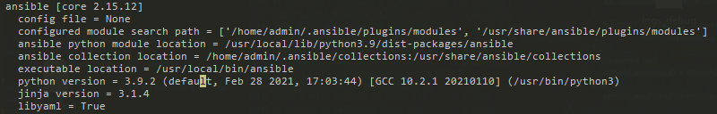

# Task 3: Install Ansible

Now that you have created a VM on Google Cloud, we can configure it to add all the required software for our needs. For that we are going to use Ansible. In this task you will install Ansible on your local machine.

The installation procedure depends on the OS on your local machine. If you run Windows it is recommended you use a Linux installation to run Ansible (Windows Subsystem for Linux with Debian/Ubuntu is fine).

To install on Linux: Use Python's package manager `pip`:

```bash
sudo pip install ansible
```

To install on macOS: Use the Homebrew package manager `brew`:

```bash
brew install ansible
```

Verify that Ansible is installed correctly by running:

```bash
ansible --version
```

**\[OUTPUT\]**

```bash
ansible [core 2.16.6]
  config file = /etc/ansible/ansible.cfg
  configured module search path = ['/home/user/.ansible/plugins/modules', '/usr/share/ansible/plugins/modules']
  ansible python module location = /usr/lib/python3.12/site-packages/ansible
  ansible collection location = /home/user/.ansible/collections:/usr/share/ansible/collections
  executable location = /usr/bin/ansible
  python version = 3.12.3 (main, Apr 17 2024, 00:00:00) [GCC 14.0.1 20240411 (Red Hat 14.0.1-0)] (/usr/bin/python3)
  jinja version = 3.1.4
  libyaml = True
```

You should see output similar to the following:

